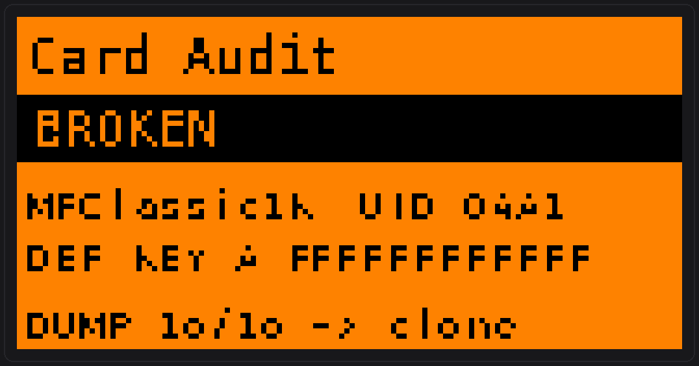
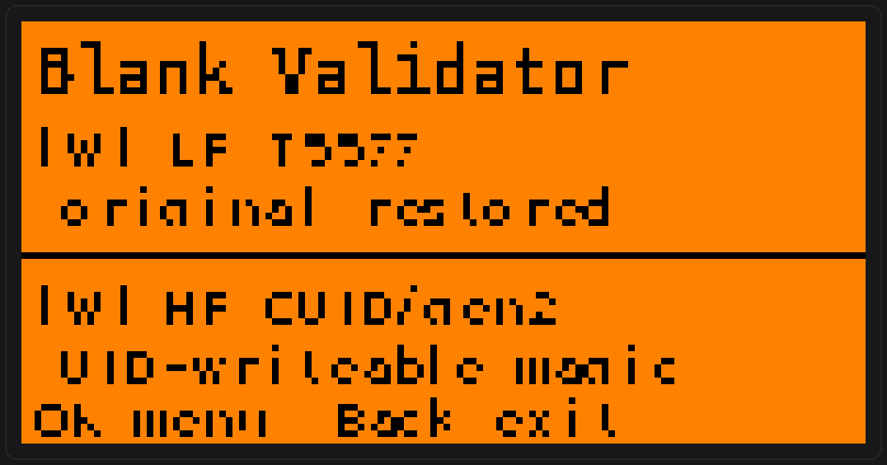
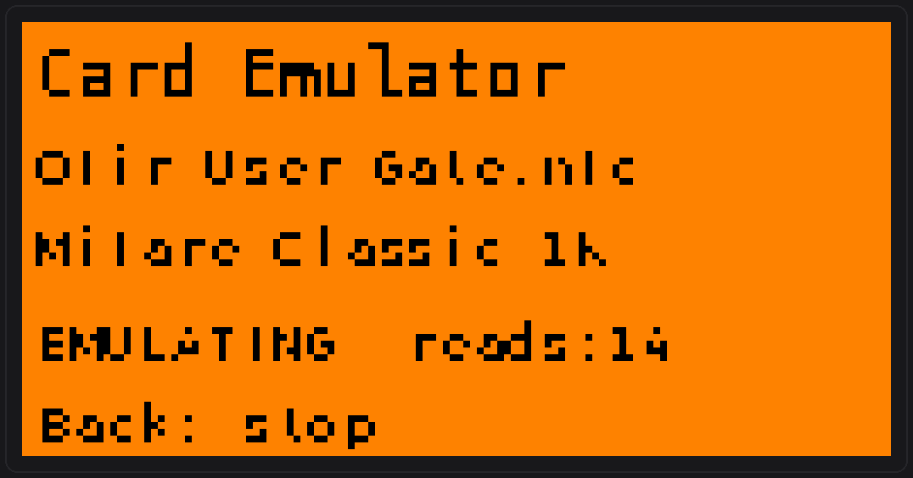
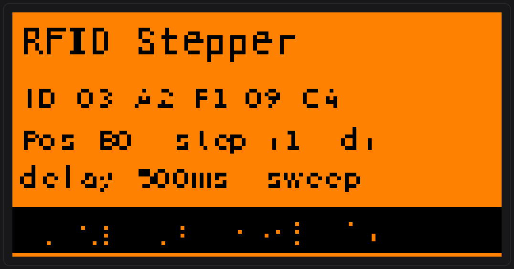
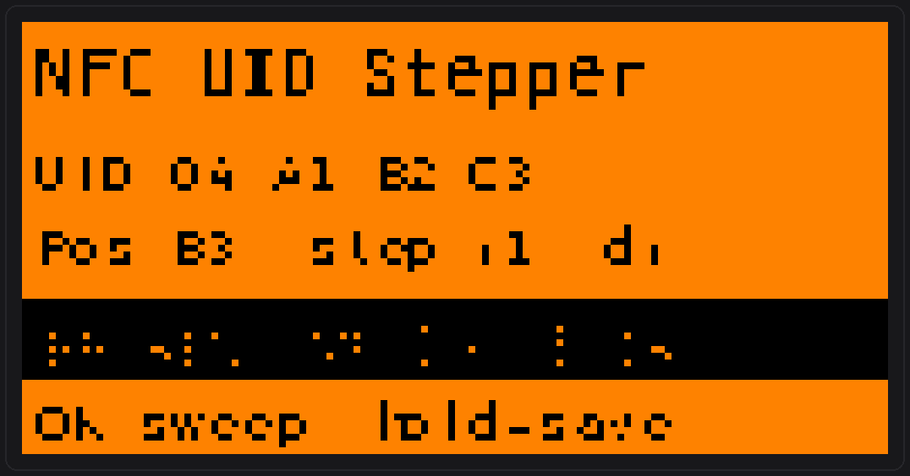
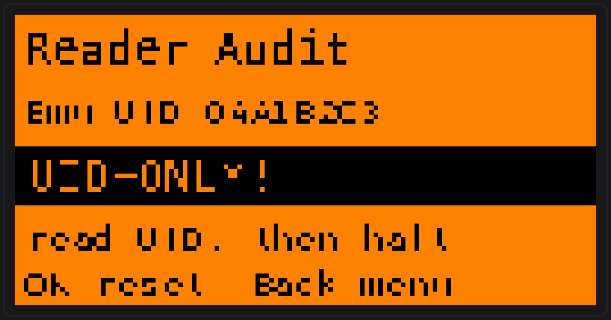
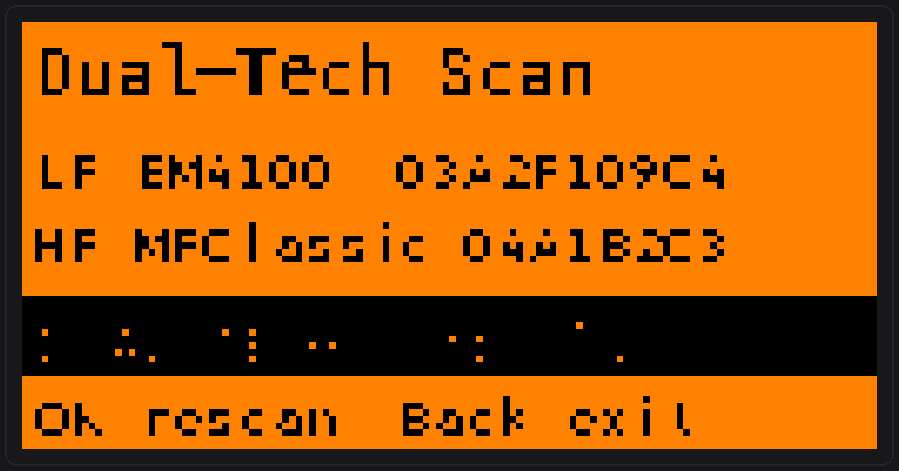
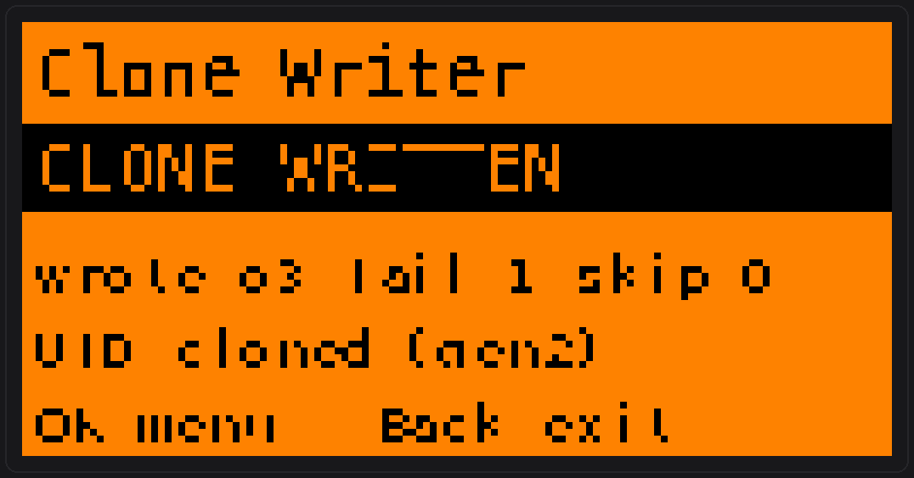
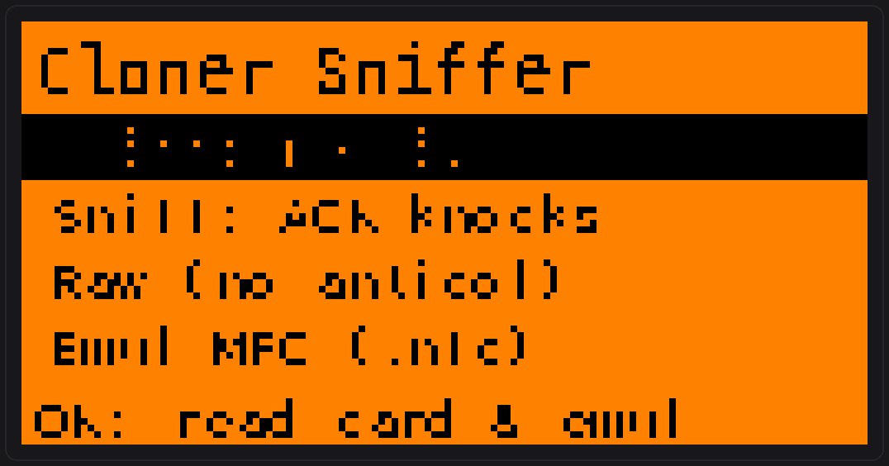
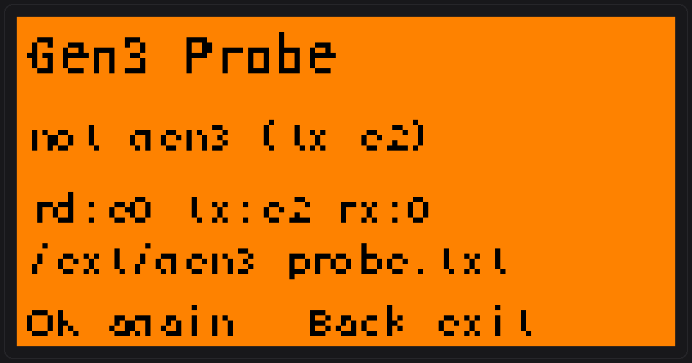

# SwissNFC/RFID Toolkit

A companion toolkit of **Flipper Zero** apps for authorized RFID/NFC security work —
reading, stepping, auditing, blank-validation, cloning, and card emulation, built to
go beyond what the stock NFC/LFRFID apps do.

<p align="center">
  
  
  
</p>

Built and verified against **Momentum firmware** (API 87.1, SDK `mntm-012`) with
[`ufbt`](https://pypi.org/project/ufbt/). Rebuild from source for other firmware.

> ⚠️ **Authorized use only.** These are dual-use security tools. Use them only on
> cards, readers, and systems you **own** or are **explicitly permitted to test**
> (pentest engagements, CTFs, research, your own lab). Card Audit enforces an
> authorization gate and every report carries an authorization notice.

---

## The apps

| App | Band | What it does |
|-----|------|--------------|
| **RFID Stepper** | LF 125 kHz | Read an EM4100 ID, step it up/down, emulate / auto-sweep; pause + quick-save; per-byte truncation test; Wiegand/HID decode; verdict + skull. |
| **NFC UID Stepper** | HF 13.56 | Same stepping/emulation for ISO14443-A UID; verdict via ATQA/SAK + DESFire GetVersion. |
| **Reader Audit** | HF | Emulate a card to a reader and classify it: **UID-only** (insecure) vs **crypto** (RATS/auth). |
| **Dual-Tech Scan** | LF+HF | Detect combo cards; flag OR-logic; hint iCLASS when LF present but no ISO HF. |
| **Card Audit** | LF+HF | Authorization-gated read → classify → **actively verify** (Mifare Classic default-key dump + save clone; DESFire generation + config; NTAG page) → SD report + viewer; load `.nfc` offline. |
| **Blank Validator** | LF+HF | Non-destructive writeability test + **magic identifier**: gen1a / CUID-gen2 / **gen3** / GDM / proprietary / normal. Auto LF-then-HF scan. |
| **Clone Writer** | HF | Write a Mifare Classic dump onto a magic blank — from a live-read source **or** a saved `.nfc`; multi-key per block. |
| **Cloner Sniffer** | HF | Card-emulation trap: emulate a card and log every frame a writer/cloner sends (passive / ACK-knocks / raw / full-MFC), capturing auth nonces for MFKey. |
| **Gen3 Probe** | HF | Non-destructive Gen3 (APDU) test — rewrites block 0 with its own data via `90F0CCCC`. |
| **Card Emulator** | HF | The Flipper *becomes* any saved card (full Mifare Classic + keys, UID, or Ultralight). Emulate instead of clone. |

## Screens

<table>
  <tr>
    <td align="center"><br><sub><b>RFID Stepper</b> — step & sweep an EM4100 ID</sub></td>
    <td align="center"><br><sub><b>NFC UID Stepper</b> — ISO14443-A UID + verdict</sub></td>
  </tr>
  <tr>
    <td align="center"><br><sub><b>Card Audit</b> — default-key dump, clone saved</sub></td>
    <td align="center"><br><sub><b>Reader Audit</b> — UID-only vs crypto reader</sub></td>
  </tr>
  <tr>
    <td align="center"><br><sub><b>Blank Validator</b> — auto LF+HF, magic ID</sub></td>
    <td align="center"><br><sub><b>Dual-Tech Scan</b> — LF+HF combo detection</sub></td>
  </tr>
  <tr>
    <td align="center"><br><sub><b>Clone Writer</b> — dump → magic blank</sub></td>
    <td align="center"><br><sub><b>Card Emulator</b> — become any saved card</sub></td>
  </tr>
  <tr>
    <td align="center"><br><sub><b>Cloner Sniffer</b> — log a writer's frames + nonces</sub></td>
    <td align="center"><br><sub><b>Gen3 Probe</b> — non-destructive Gen3 APDU test</sub></td>
  </tr>
</table>

<sub>Screens are faithful 128×64 mockups rendered from each app's actual draw code.</sub>

## Install (no build)

Copy the ten `.fap` files from [`release/swissnfcrfid/`](release/swissnfcrfid) into a
folder `apps/swissnfcrfid/` on the Flipper SD card (qFlipper or the mobile app). They
appear together under **Apps → swissnfcrfid** on the device.

## Build from source

```bash
pip install ufbt
ufbt update --index-url=https://up.momentum-fw.dev/firmware/directory.json --channel=release
cd flipper/<app> && ufbt         # -> dist/<app>.fap
ufbt launch                      # build + install + run on a connected Flipper
```

## Companion tools (recommended alongside this toolkit)

This toolkit intentionally leaves some gaps that purpose-built tools fill:

- **[MFKey](https://github.com/flipperdevices/flipperzero-good-faps/tree/dev/mfkey)** —
  recover **non-default** Mifare Classic keys (mfkey32 / nested). Card Audit only tries a
  default-key dictionary; MFKey fills that gap. Cloner Sniffer's *Emul MFC* mode writes
  `/ext/nfc/.mfkey32.log` to feed it.
- **[NFC Magic](https://github.com/flipperdevices/flipperzero-good-faps/tree/dev/nfc_magic)** —
  write magic cards (gen1a/gen2/gen4-GTU). The proper UID-cloning tool.
- **[NFCMiTM](https://github.com/a66at/NFCMiTM)** — hardware relay MITM (Raspberry Pi +
  2× PN532) for ISO14443-4 / APDU protocol capture.

**Lab chains:** `Detect Reader → MFKey → Card Audit → Clone Writer` (crack, dump, clone) ·
`Card Audit → Blank Validator → NFC Magic / Clone Writer` (clone onto a blank) ·
`Card Audit → Card Emulator` (become the card — no clone needed).

## Docs

- [`docs/RFID_clone_reference.html`](docs/RFID_clone_reference.html) — the "can I clone
  this card?" (dd) model + full vulnerability matrix.
- [`docs/APPS_AND_TOOLS.txt`](docs/APPS_AND_TOOLS.txt) — per-app manual + companion tools.
- [`VULN_CATALOG.md`](VULN_CATALOG.md) — vulnerability catalog + detection signatures.
- [`STATUS.md`](STATUS.md) — engineering notes, build/deploy, bench-test progress.

## License

MIT — see [LICENSE](LICENSE). Authorized security testing, research, and education only.
